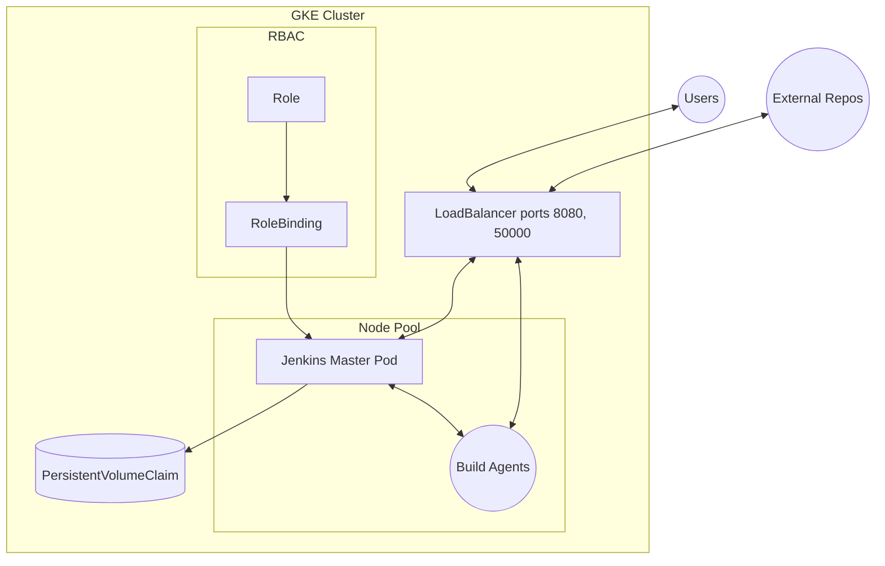

# Architecture Specification for CI/CD Infrastructure on GCP with Jenkins

## Overview

This project sets up a highly automated and scalable CI/CD infrastructure on Google Cloud Platform (GCP) using Jenkins as the primary CI/CD tool. The infrastructure is designed to dynamically scale Jenkins agents based on workload demands, using Google Kubernetes Engine (GKE) to orchestrate auto-scaling. The CI/CD pipeline is configured to be triggered by code changes in GitHub, with Jenkins managing the end-to-end build, test, and deployment workflows using Configuration as Code (JCasC).

## Components of the Architecture

### 1. Google Kubernetes Engine (GKE) Cluster

* Cluster Configuration: The GKE cluster is configured in the main.tf file.
* Node Pools: The cluster includes a node pool for Linux builds, with auto-scaling enabled.
* Persistent Storage: A PersistentVolumeClaim (PVC) is used to provide storage for Jenkins's data, ensuring that job history, configuration, and other persistent data are retained across pod restarts or updates.

### 2. Jenkins Deployment

* Configuration as Code: Jenkins is configured using JCasC (Jenkins Configuration as Code)
* Security: Configured with matrix-based security and local user authentication
* Plugins: Managed through a ConfigMap, including essential plugins for Kubernetes integration, GitHub, and pipeline support
* Persistent Storage: Uses PVC for data persistence
* Build Agents: Dynamically provisioned Kubernetes pods using the jenkins/inbound-agent image

### 3. Networking

* Service Configuration: Jenkins is exposed via a LoadBalancer service on ports 8080 (web UI) and 50000 (JNLP)
* Internal Communication: Uses Kubernetes service discovery for agent communication
* Role and Role Binding: RBAC configured to allow Jenkins to manage pods within the cluster

### 4. Security

* Authentication: Local user authentication with matrix-based authorization
* Credentials: Managed through Kubernetes secrets for GitHub integration
* CSRF Protection: Enabled by default
* API Token Management: Controlled through security settings
* Build Isolation: All builds run on ephemeral Kubernetes agents

### 5. Pipeline Configuration

* Job DSL: Automated job creation using Job DSL scripts
* GitHub Integration: Configured with webhook triggers for automated builds
* Build Agents: Dynamically provisioned with specified resource limits and container configurations

